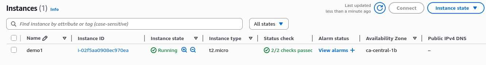
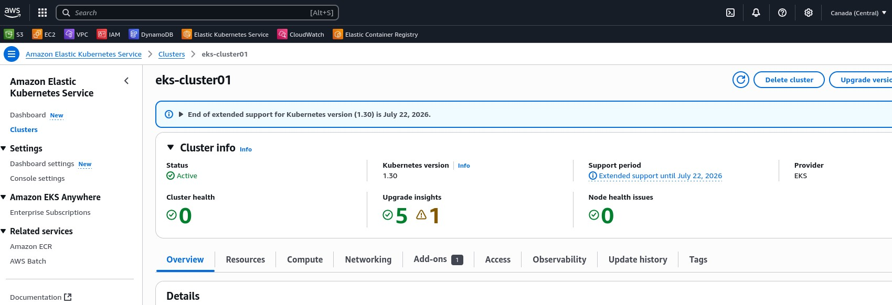
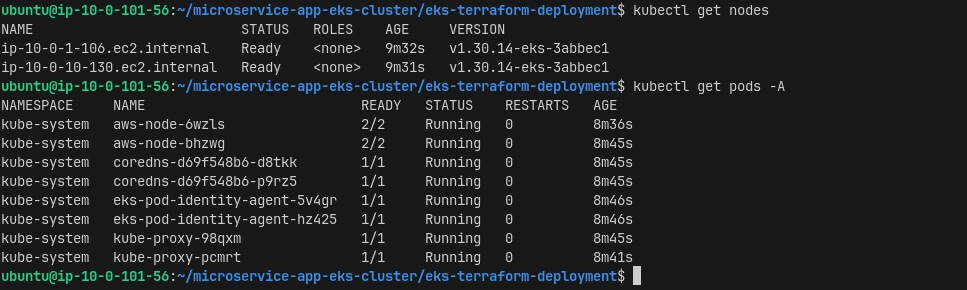
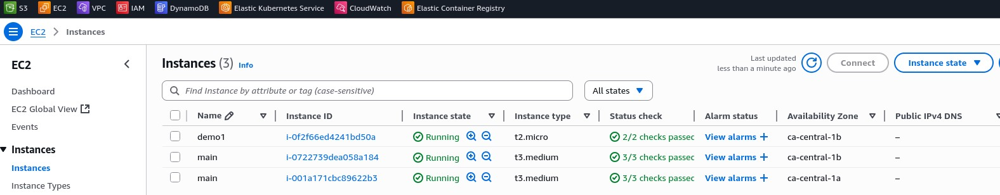
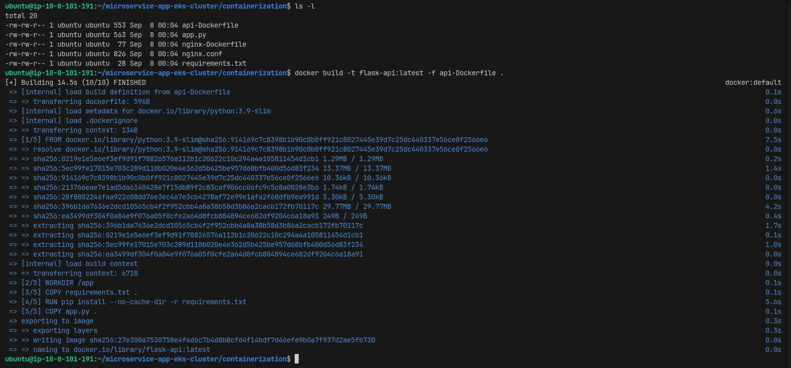
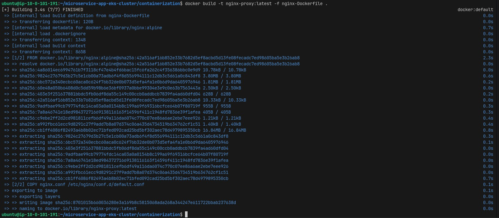
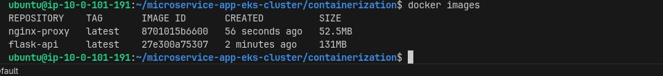
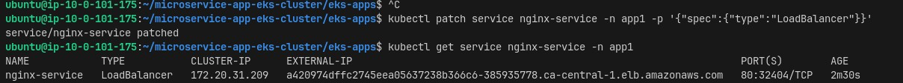
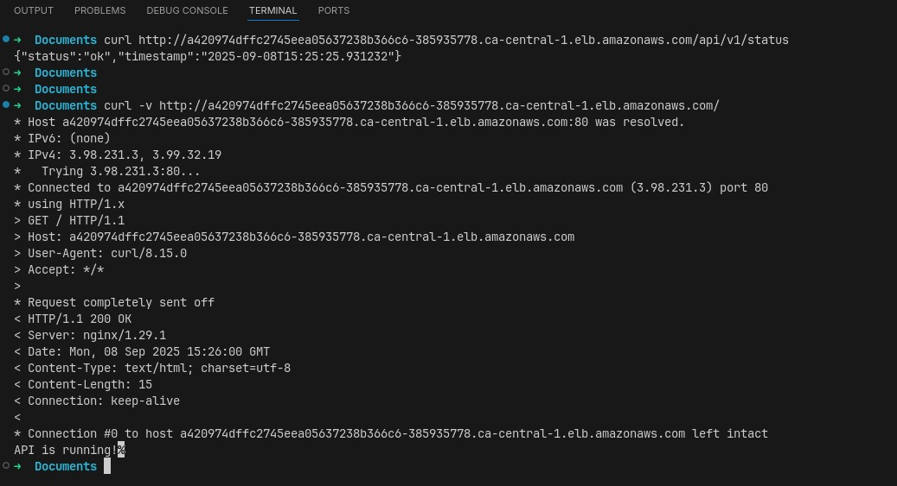
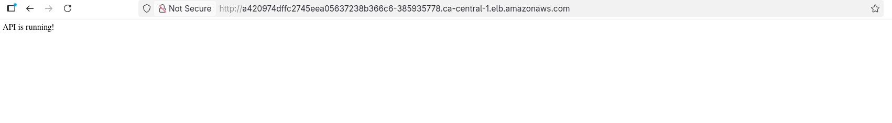

# Microservice App on AWS EKS with Terraform

This project demonstrates building and deploying a Flask API with Nginx proxy to AWS EKS using Terraform. We'll set up the entire infrastructure from scratch and deploy containerized applications.

## What We're Building

- **EC2 Development Instance** - Pre-configured with all required tools
- **EKS Cluster** - Managed Kubernetes on AWS with proper networking
- **AWS Load Balancer Controller** - For managing Application Load Balancers
- **Flask API** - Simple REST API with health check endpoints
- **Nginx Proxy** - Routes traffic to our API
- **Application Load Balancer** - Routes internet traffic to our app

---

## Technical Stack

### Infrastructure & Cloud
- **Terraform** `v1.13.1` - Infrastructure as Code
- **AWS EKS** `v1.30` - Managed Kubernetes service
- **Amazon EC2** - Virtual machines (t2.micro, t3.medium)
- **Amazon VPC** - Networking with public/private subnets
- **Application Load Balancer** - Layer 7 load balancing
- **Amazon ECR** - Container registry

### Container Platform
- **Kubernetes** `v1.30` - Container orchestration
- **Docker** - Container runtime and building
- **AWS Load Balancer Controller** `v2.7.2` - ALB management
- **EKS Managed Node Groups** - Auto-scaling workers

### Application & Tools
- **Python Flask** - Web application framework
- **Nginx** - Reverse proxy and web server
- **Ubuntu 22.04 LTS** - Base operating system
- **Helm** `v3.x` - Kubernetes package manager
- **eksctl** - EKS management tool
- **kubectl** - Kubernetes CLI
- **AWS CLI** `v2.x` - AWS command-line interface

### Key Features
-  Multi-AZ high availability
-  Auto-scaling node groups  
-  Load balancer integration
-  Container registry (ECR)
-  CloudWatch monitoring
-  Infrastructure as Code
-  Production-ready setup


## Prerequisites

### AWS Account Setup

1. Create an AWS account and IAM user with `AdministratorAccess` policy
2. Generate access keys for the user
3. Have an existing SSH key pair or create one:
   ```bash
   aws ec2 create-key-pair --key-name demo-server-ec2awskey --region us-east-1 --query 'KeyMaterial' --output text > ~/.ssh/demo-server-ec2awskey.pem
   chmod 600 ~/.ssh/demo-server-ec2awskey.pem
   ```

---

## Infrastructure Setup

### Step 1: Deploy EC2 Development Instance

First, we'll create an EC2 instance with all tools pre-installed.

1. **Navigate to EC2 terraform directory:**
   ```bash
   cd ec2-terraform-deployment/
   ```

2. **Update `terraform.tfvars` with your settings:**
   ```hcl
   aws_region  = "ca-central-1"
   aws_profile = "default"
   
   vpc_name = "demo_vpc"
   vpc_cidr = "10.0.0.0/16"
   
   private_subnets = {
     "private_subnet_1" = 1
   }
   
   public_subnets = {
     "public_subnet_1" = 1
   }
   
   instance_name = "demo1"
   my_ami        = "ami-04b4f1a9cf54c11d0" # Ubuntu 22.04 LTS
   
   existing_key_pair_name = "demo-server-ec2awskey"
   private_key_path       = "~/.ssh/demo-server-ec2awskey.pem"
   ```

3. **Deploy the infrastructure:**
   ```bash
   terraform init
   terraform plan
   terraform apply
   ```

4. **Get the outputs for EKS configuration:**
   ```bash
   terraform output
   ```
   Note down the `vpc_id` and `iam_role_arn` values.

5. **Connect to your EC2 instance:**
   ```bash
   ssh -i ~/.ssh/demo-server-ec2awskey.pem ubuntu@$(terraform output -raw instance_public_ip)
   ```


### Step 2: Deploy EKS Cluster

Now from the EC2 instance, we'll deploy the EKS cluster.

1. **On your EC2 instance, clone your project:**
   ```bash
   cd ~/
   git clone <your-repo-url>
   cd microservice-app-eks-cluster/eks-terraform-deployment/
   ```

2. **Update `terraform.tfvars` with actual values from EC2 output:**
   ```hcl
   aws_region  = "ca-central-1"
   aws_profile = "default"
   environment = "dev"
   
   # EKS Cluster Configuration
   cluster_name    = "eks-cluster01"
   cluster_version = "1.30"
   
   # Use actual values from EC2 terraform output
   existing_vpc_id = "vpc-xxxxxxxxx"  # Replace with actual VPC ID
   ec2_iam_role_arn = "arn:aws:iam::AWSACCOUNT:role/ec2-eks-admin-role"
   
   # Node Group Configuration
   node_instance_types     = ["t3.medium"]
   node_group_min_size     = 1
   node_group_max_size     = 4
   node_group_desired_size = 2
   ```

3. **Deploy the EKS cluster (takes 15-20 minutes):**
   ```bash
   terraform init
   terraform plan
   terraform apply
   ```


4. **Configure kubectl access:**
   ```bash
   aws eks update-kubeconfig --region ca-central-1 --name eks-cluster01
   kubectl get nodes
   ```



5. **Worknodes Instances working for the EKS cluster**



---

## Phase 1: AWS Load Balancer Controller Installation

The AWS Load Balancer Controller enables us to create Application Load Balancers automatically from Kubernetes Ingress resources.

### Step 1: Create IAM Policy for Load Balancer Controller

```bash
# Download the IAM policy document
curl -O https://raw.githubusercontent.com/kubernetes-sigs/aws-load-balancer-controller/v2.7.2/docs/install/iam_policy.json

# Create IAM policy
aws iam create-policy \
    --policy-name AWSLoadBalancerControllerIAMPolicy \
    --policy-document file://iam_policy.json
```

### Step 2: Create IAM Role and Service Account

```bash
# Create service account with IAM role
eksctl create iamserviceaccount \
  --cluster=eks-cluster01 \
  --namespace=kube-system \
  --name=aws-load-balancer-controller \
  --role-name "AmazonEKSLoadBalancerControllerRole" \
  --attach-policy-arn=arn:aws:iam::800216803559:policy/AWSLoadBalancerControllerIAMPolicy \
  --approve
```

### Step 3: Install via Helm

```bash
# Add the EKS chart repository
helm repo add eks https://aws.github.io/eks-charts
helm repo update

# Get your VPC ID
VPC_ID=$(aws ec2 describe-vpcs --filters "Name=tag:Name,Values=demo_vpc" --query "Vpcs[0].VpcId" --output text)
echo "VPC ID: $VPC_ID"

# Install AWS Load Balancer Controller
helm install aws-load-balancer-controller eks/aws-load-balancer-controller \
  -n kube-system \
  --set clusterName=eks-cluster01 \
  --set serviceAccount.create=false \
  --set serviceAccount.name=aws-load-balancer-controller \
  --set region=ca-central-1 \
  --set vpcId=$VPC_ID
```

### Step 4: Verify Installation

```bash
# Check if the controller is running
kubectl get deployment -n kube-system aws-load-balancer-controller

# Check the pods
kubectl get pods -n kube-system -l app.kubernetes.io/name=aws-load-balancer-controller

# Verify it's working
kubectl logs -n kube-system deployment/aws-load-balancer-controller
```

You should see the deployment with `2/2` ready pods:
```
NAME                           READY   UP-TO-DATE   AVAILABLE   AGE
aws-load-balancer-controller   2/2     2            2           2m
```

---

## Phase 2: Application Container Deployment

Now we'll build and deploy our Flask API and Nginx proxy containers.


### Step 1: Set Up ECR Repositories

```bash
# Create ECR repositories for your images
aws ecr create-repository --repository-name flask-api --region ca-central-1
aws ecr create-repository --repository-name nginx-image --region ca-central-1

# Get your account ID and login to ECR
ACCOUNT_ID=$(aws sts get-caller-identity --query Account --output text)
aws ecr get-login-password --region ca-central-1 | docker login --username AWS --password-stdin $ACCOUNT_ID.dkr.ecr.us-east-1.amazonaws.com
```

### Step 2: Build and Push Container Images

```bash
# Navigate to your application directory
cd ~/microservice-app-eks-cluster/

# Build your Flask API image (assuming you have a Dockerfile)
docker build -t flask-api:latest -f path/to/api-Dockerfile .
```


## Build your Nginx proxy image
docker build -t nginx-image:latest -f path/to/nginx-Dockerfile .



## Tag for ECR



docker tag flask-api:latest $ACCOUNT_ID.dkr.ecr.us-east-1.amazonaws.com/flask-api:latest
docker tag nginx-image:latest $ACCOUNT_ID.dkr.ecr.us-east-1.amazonaws.com/nginx-image:latest

## Push to ECR
```
docker push $ACCOUNT_ID.dkr.ecr.us-east-1.amazonaws.com/flask-api:latest
docker push $ACCOUNT_ID.dkr.ecr.us-east-1.amazonaws.com/nginx-image:latest
```


### Step 3: Deploy Application to EKS

1. **Create the namespace:**
   ```bash
   kubectl apply -f eks-apps/namespace.yaml
   ```

2. **Update the image URIs in your deployment files:**
   
   Edit `eks-apps/api-deployment.yaml`:
   ```yaml
   # Update the image line to use your account ID and region
   image: 800216803559.dkr.ecr.us-east-1.amazonaws.com/flask-api:latest
   ```
   
   Edit `eks-apps/nginx-deployment.yaml`:
   ```yaml
   # Update the image line to use your account ID and region
   image: 800216803559.dkr.ecr.us-east-1.amazonaws.com/nginx-image:latest
   ```

3. **Deploy your applications:**
   ```bash
   # Deploy Flask API
   kubectl apply -f eks-apps/api-deployment.yaml
   
   # Deploy Nginx proxy
   kubectl apply -f eks-apps/nginx-deployment.yaml
   ```

### Step 4: Create Application Load Balancer with Ingress

Create an ingress file `eks-apps/ingress-alb.yaml`:

```yaml
apiVersion: networking.k8s.io/v1
kind: Ingress
metadata:
  name: app-ingress
  namespace: app1
  annotations:
    kubernetes.io/ingress.class: alb
    alb.ingress.kubernetes.io/scheme: internet-facing
    alb.ingress.kubernetes.io/target-type: ip
spec:
  rules:
    - http:
        paths:
        - path: /
          pathType: Prefix
          backend:
            service:
              name: nginx-service
              port:
                number: 80
```

Deploy the ingress:
```bash
kubectl apply -f eks-apps/ingress-alb.yaml
```

### Step 5: Verify Your Deployment

```bash
# Check all resources in your namespace
kubectl get all -n app1

# Check the ingress (ALB creation takes a few minutes)
kubectl get ingress -n app1

```

---

Load Balancer Options Exercise
Once your app is deployed, let's explore different access methods:
Exercise 1: NodePort (FREE)

## Convert nginx service to NodePort
```
kubectl patch service nginx-service -n app1 -p '{"spec":{"type":"NodePort"}}'
```
## Get the port
```
kubectl get service nginx-service -n app1
```
## Access via: http://<node-public-ip>:32XXX

Exercise 2: Classic Load Balancer (~$18/month)

## Convert to LoadBalancer
```
kubectl patch service nginx-service -n app1 -p '{"spec":{"type":"LoadBalancer"}}'
```

## Wait for external IP
```
kubectl get service nginx-service -n app1 -w
```


and on API end-point checks



and on Browser




## Monitoring and Troubleshooting

### Useful Commands

```bash
# Check pod logs
kubectl logs -f deployment/api-deployment -n app1
kubectl logs -f deployment/nginx-deployment -n app1

# Check pod status
kubectl describe pod <pod-name> -n app1

# Check ingress details
kubectl describe ingress app-ingress -n app1

# Check ALB controller logs
kubectl logs -n kube-system deployment/aws-load-balancer-controller

# Check all events
kubectl get events -n app1 --sort-by='.lastTimestamp'
```

### Common Issues

1. **Pods not starting:** Check image URLs and ensure they're pushed to ECR
2. **ALB not creating:** Verify AWS Load Balancer Controller is running and check its logs
3. **Application not accessible:** Ensure ingress annotations are correct and ALB is provisioned

---

## Cleanup

When you're done, clean up resources to avoid charges:

```bash
# Delete the application
kubectl delete namespace app1

# From EC2 instance, destroy EKS cluster
cd ~/microservice-app-eks-cluster/eks-terraform-deployment/
terraform destroy

# From your local machine, destroy EC2 infrastructure
cd ec2-terraform-deployment/
terraform destroy

# Delete ECR repositories
aws ecr delete-repository --repository-name flask-api --region ca-central-1 --force
aws ecr delete-repository --repository-name nginx-image --region ca-central-1 --force
```


---

## Summary

-  Created a VPC with public/private subnets
-  Deployed an EC2 development instance with all tools
-  Set up an EKS cluster with managed node groups
-  Installed AWS Load Balancer Controller
-  Built and pushed container images to ECR
-  Deployed a microservice application with load balancing


This setup provides a production-ready foundation for deploying containerized applications on AWS EKS!


